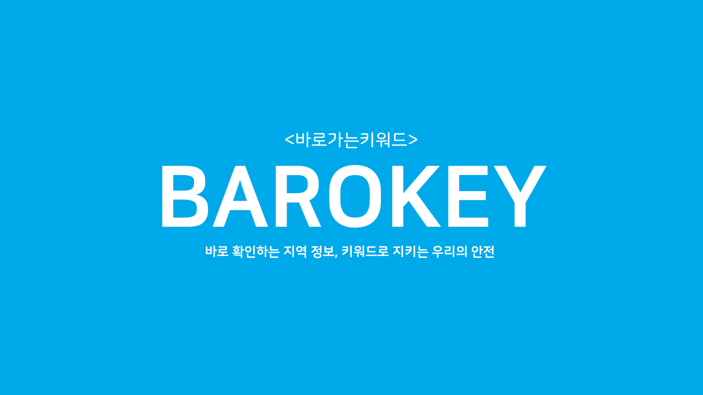
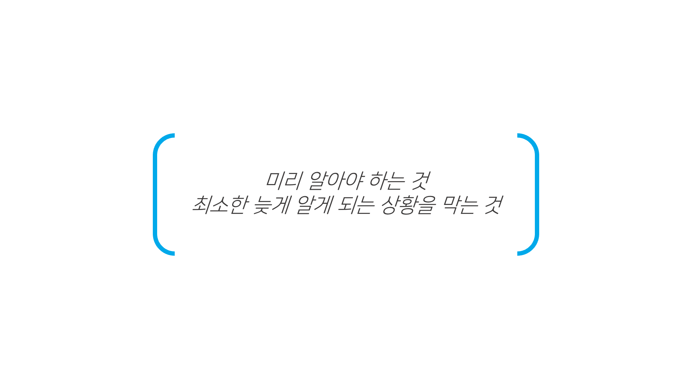
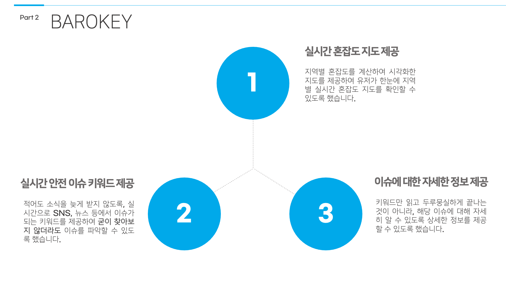
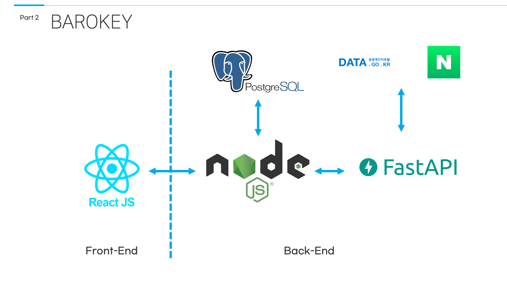

    <h1>바로키, 바로가는 키워드</h1>
    
바로 확인하는 지역 정보, 키워드로 지키는 우리 안전

    
Made by Team04, Leo.

     
    

---
# Disclaimer 🙏
이 프로젝트는 제 3회 Uni-DTHON 해커톤 부문에서 `Team04`에 의해 출품된 작품입니다. 🎉

This project was introduced in the 3th Uni-DTHON Hackaton by `Team04`. 🎉

해당 프로젝트의 실제 서비스는 이뤄지지 않고 있으니 참고 부탁드립니다!

Please note that actual service of the project is not being provided!

제 3회 Uni-DTHON에 대한 내용은 다음 링크에서 확인할 수 있습니다! [link](docs/unidthon.md)

You can check more information about the 3rd Uni-DTHON in the next link! [link](docs/unidthon.md)

---
# About this project 📊

    

유저 근처에 존재하는 위험의 원인에 대해 인지하기까지 걸리는 시간을 줄이고 싶었습니다.

We wanted to reduce the total time until the recognizing the source of danger near the user.

"바로 확인하는 지역 정보, 키워드로 지키는 우리 안전"이라는 부제에 맞게 유저가 짧막한 키워드를 통해 상황을 쉽게 이해하는 것이 궁극적인 목표입니다.

Out ultimate goal is that user can recognize the situation with a short keyword as our sub-title, "Checking nearby information directly, secure ourselves with a keyword."

바로키는 유저 주변의 실시간 이슈를 유저가 한 눈에 빠르게 살펴 볼 수 있는 웹 서비스를 제공합니다.

BAROKEY provides a web service where the user can recognize the today's headlines near the user at a glance.

---
# Features 💡

    

### #1. 실시간 혼잡도 지도 제공 Real-Time Congestion Map

    

유저 근처의 지역 혼잡도를 지도 상에 시각화하여 제공합니다.

Provides the visualized degree of congestion of the region near the user.

지역의 색깔이 붉을 수록 혼잡도가 높으며 위험하다는 사실을 나타냅니다.

The more saturated in red the color of region is, the higher degree of congestion the region has and more dangerous it is.

### #2. 실시간 안전 이슈 키워드 제공 Real-Time Safety Related Issue Keywords

    

현재 실시간으로 안전과 관련되어 이슈가 되는 키워드들을 요약하여 단어 구름(Word Cloud) 형태로 나타냅니다.

Show Word Cloud of real time issuing keywords related to safety.

단어의 애니메이션을 통해 시각적인 효과를 통해 눈에 잘 들어오도록 하였습니다.

Implemented some animation of words for visually easy recognizing at a glance.

### #3. 이슈에 대한 자세한 정보 제공 Details About the Issue

    

선택된 이슈 키워드에 대한 SNS(Facebook, Instagram, X(구 twitter) ...) 글, 뉴스를 요약해 보여줍니다.

Show summary of articles for selected issue keyword from SNS(Facebook, Instagram, X(ex-twitter) ...) and News.

해당 글을 클릭할 경우 원본 글로 이동됩니다.

When clicking the article, it leads you to the original article.

---
# Service Architecture 🛠️

    

## Front-End
React-JS를 이용하여 프런트엔드를 구현하였습니다.

Implemented Front-End with React-JS.

## Back-End
### Back-End Server
Node.js를 이용하여 기본 백엔드 서버를 구현하였고, 주기적으로 dummy server(FastAPI)에서 정보를 불러와 DB에 저장합니다.

Implemented the basic Back-End server using Node.js, it periodically scrapes the information from dummy server(FastAPI) and saves it to the DB.

### Dummy Server
Dummy Server는 FastAPI와 Selenium을 이용하여 뉴스 등과 실시간 API 정보를 크롤링하여 제공합니다.

Dummy Server provides data of crawled information from new etc. and real time API using FastAPI and Selenium.

---
# Tech Stacks 🎨
- Front-End :    
- Back-End :    
- Deploy :  

---
# Further Improvements ⚙️
## Mobile Support
사용자가 더 빠른 시간 내에 정보를 획득할 수 있는 플랫폼은 모바일일 것이라고 생각됩니다.

We thought the platform where the user can get the information quickly would be mobile.

추후 GPS 기반의 앱 서비스를 통해 자동으로 위험 정보를 푸시 알림을 통해 제공할 수 있다면 더욱 취지에 부합하는 서비스가 될 것이라고 생각합니다.

Providing safety alerts with push notification based on GPS-based application later, it would be more suitable with our goals.

## User Community Support
일반 SNS을 통한 안전 정보 수집은 안전 이외의 주제로 인한 딜레이가 존재할 것으로 생각됩니다.

There would be a little delay for collecting the safety related information in normal SNS due to the general issues not related to safety.

유저들이 직접 안전 정보에 대한 내용을 공유할 수 있는 커뮤니티를 제공하는 것 또한 긍정적인 효과를 가져올 것으로 생각됩니다.

Running the community where the users can share safety information would bring positive effect.

---
# Credits 🎥
## Team Members
| 
Name
   | 
School
                          | 
GitHub
                                                                                                               |
| -------------------------------- | --------------------------------------------------------- | ---------------------------------------------------------------------------------------------------------------------------------------------- |
| 
김민서
 | 
포항공과대학교 컴퓨터공학과
     | 

     |
| 
김태완
 | 
성균과대학교 소프트웨어융합대학
 | 

 |
| 
류미성
 | 
숙명여자대학교 소프트웨어학부
   | 

  |
| 
선민수
 | 
포항공과대학교 컴퓨터공학과
     | 

       |
| 
정윤서
 | 
숙명여자대학교 소프트웨어학부
   | 

           |

## Contributions
| 
Division
  | 
Description
                           | 
Members
                          |
| ----------------------------------- | --------------------------------------------------------------- | ---------------------------------------------------------- |
| 
Front-End
 | 
React-JS를 이용한 프런트엔드 개발
     | 
김민서, 류미성 김태완, 정윤서
 |
| 
Back-End
  | 
Node.js, FastAPI를 이용한 백엔드 개발
 | 
김민서, 선민수
                   |
| 
Deploy
    | 
AWS, Docker를 이용한 배포 작업
        | 
김민서, 선민수
                   |

---
# Presentation 🔖
발표 슬라이드는 다음 링크에서 확인할 수 있습니다! [link](docs/presentations.md)

You can check the full presentation slides in the next link! [link](docs/presentations.md)